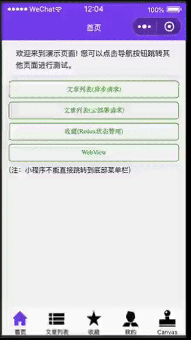

# Full-Stack Taro Application Template
  
这个存储库是一个基于Taro构建的全栈小程序示例模板，它创建了一个简单的扩展架构(跨组件状态管理, 异步请求等)，并提供了启动和运行基本应用程序所需的基础服务、组件和管道。


[English Documentation](README.md) | [中文版说明文档](README_CN.md)




## 提供方案

这里列出完成的的进度:

| 功能块 | 支持 |
| --- | --- |
| 导航 | ✔ |
| 参数获取 | ✔ |
| 授权 | ✔ |
| 登录 | ✔ |
| 注册 | ✔ |
| 状态管理 | ✔ |
| 网络请求 | ✔ |
| 上传 | ✔ |
| 文件系统（针对图片） | ✔ |
| 链接跳转 | ✔ |
| 滑动触发器 | ✔ |
| Canvas演示 | ✔ |
| HTML5标签 | ✔ |
| 拖拽移动（针对上传的图片） | ✔ |


## 目录结构

```sh
fullstack-taro-app-template/
├── README.md
├── LICENSE
├── project.config.json        # 小程序项目配置
├── project.tt.json
├── babel.config.js
├── tsconfig.json
├── package-lock.json
├── package.json                # Node.js manifest
├── dist/                       # 打包目录
├── config                      # 编译配置目录
│   ├── dev.js                  # 开发模式配置
│   ├── index.js                # 默认配置
│   └── prod.js                 # 生产模式配置
├── src
│   ├── app.config.ts           # 全局配置
│   ├── app.scss                # 全局 CSS
│   ├── app.tsx                 # 入口组件
│   ├── index.html              # H5 入口 HTML
│   └── pages                   # 页面组件
│   │   └── index
│   │       ├── index.config.ts # 页面配置
│   │       ├── index.scss      # 页面 CSS
│   │       └── index.jsx       # 页面组件，如果是 Vue 项目，此文件为 index.vue
│   │
│   ├── status/                 # 使用 Redux 来管理跨组件状态的目录
│   ├── assets/
│   ├── config/
│   ├── components/    
│   └── ...
└──
```


## 开发调试


**Step 1.** 克隆项目

```sh
$ git clone git://github.com/xizon/fullstack-taro-app-template.git
```


**Step 2.** 进入您所在设备的 `"fullstack-taro-app-template/"` 目录.

```sh
$ cd /{your_directory}/fullstack-taro-app-template
```


**Step 3.** 确保安装了 `Node 14+`, 接下去安装依赖项.

```sh
$ sudo npm install
```

**Step 4.** 测试和打包应用的代码类似

```sh
$ npm run dev:h5
$ npm run build:h5
```

**Step 5 (可选).** 单元测试

```sh
$ npm run test
```


## Taro开发环境配置流程

**Step 1.**  安装 [node](https://nodejs.org/), [Taro CLI](https://taro.zone/) 到您的设备中.

```sh
# 全局安装Node
$ curl -fsSL https://rpm.nodesource.com/setup_16.x | sudo bash -
$ sudo yum install -y nodejs
$ node -v

# 全局安装Taro CLI
$ sudo npm i -g @tarojs/cli
$ taro -v
```

**Step 2.** 安装Taro模板

```sh
$ cd /{your_directory}
$ sudo taro init
```

## 其它常见问题


### ⚙️ 使用别名或者其他，修改以下文件:

首先需要安装一个依赖:

```sh
$ npm i babel-plugin-module-resolver
```

接着修改下面的配置文件: 

config/index.js 

```js
    alias: {
        '@': path.resolve(__dirname, '..', 'src'),
        '@/config': path.resolve(__dirname, '..', 'src/config'),
        '@/components': path.resolve(__dirname, '..', 'src/components'),
        '@/status': path.resolve(__dirname, '..', 'src/status'),
        '@/utils': path.resolve(__dirname, '..', 'src/utils'),
        '@/assets': path.resolve(__dirname, '..', 'src/assets')

    },
```


package.json

```json
  "jest": {
    "testEnvironment": "jsdom",
    "moduleNameMapper": {
      "\\.(css|less|scss|sass)$": "identity-obj-proxy",
      "^@/(.*)": "<rootDir>/src/$1",
      "^@/config/(.*)": "<rootDir>/src/config/$1",
      "^@/components/(.*)": "<rootDir>/src/components/$1",
      "^@/status/(.*)": "<rootDir>/src/status/$1",
      "^@/utils/(.*)": "<rootDir>/src/utils/$1",
      "^@/assets/(.*)": "<rootDir>/src/assets/$1"
    },
    "transform": {
      "^.+\\.(js|jsx)$": "babel-jest",
      "^.+\\.(ts|tsx)?$": "ts-jest"
    }
  },
```

默认没有安装 **Jest**，如果需要，请执行下面的代码：

```sh
$ npm i @testing-library/jest-dom @types/jest jest ts-jest --save-dev
```


tsconfig.json

```json
    "baseUrl": "./src",
    "paths": {
      "@/*": ["*"],
      "@/config/*": ["config/*"],
      "@/components/*": ["components/*"],
      "@/status/*": ["status/*"],
      "@/utils/*": ["utils/*"],
      "@/assets/*": ["assets/*"]
    },
```


babel.config.js 

```js
    "plugins": [
        ["module-resolver", {
            "root": ["./src"],
            "alias": {
                "@/": "./src",
                "@/config": "./src/config",
                "@/components": "./src/components",
                "@/status": "./src/status",
                "@/utils": "./src/utils",
                "@/assets": "./src/assets"
            }
        }]

    ]
```


### ❌ 报错: `[object Object] is not a PostCSS plugin Error: pages/index/index.wxss from Css Minimizer plugin`

解决方案：

```sh
$ npm i postcss --save-dev
```

### ❌ 报错: `Uncaught ReferenceError: $RefreshReg$ is not defined`

解决方案：

禁用快速刷新,修改配置文件 `config/index.js` 和 `babel.config.js`。


config/index.js

```js
  h5: {
    devServer: {
      hot: false 
    }
  }
```


babel.config.js

```js
  presets: [
    ['taro', {
      framework: 'react',
      hot: false
    }]
  ]
```

## 更新日志

[releases](CHANGELOG.md)


## 感谢

- [React](https://reactjs.org/)
- [Taro](https://taro.zone//)
- [redux](https://redux.js.org/)


## 支持的开发环境

- Taro 3.5.* +
- React 18 +


## 许可证

Licensed under the [MIT](https://opensource.org/licenses/MIT).


